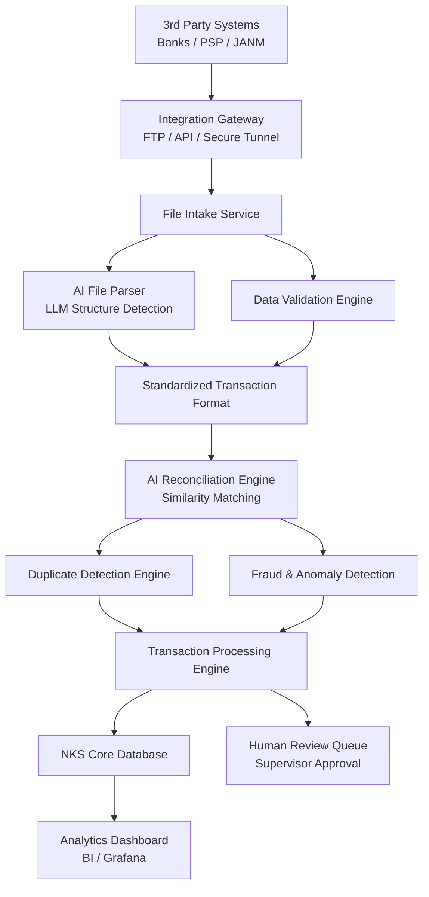
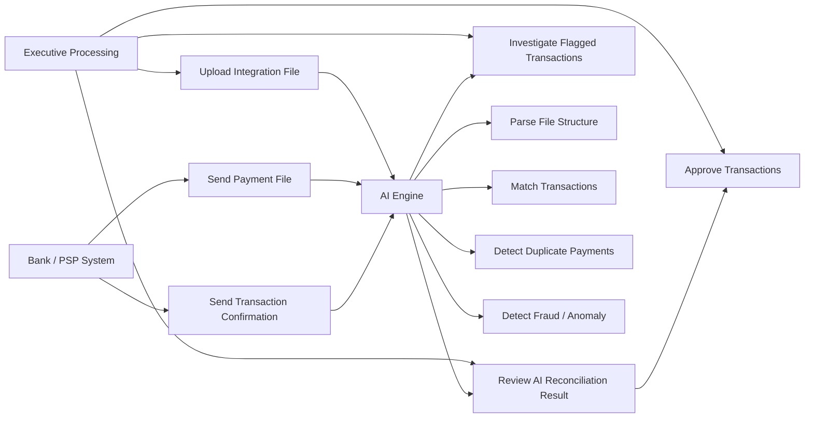
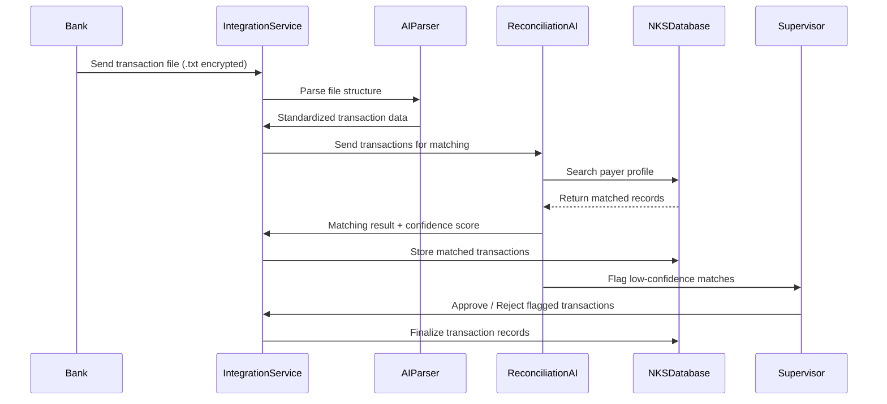

# NKS 2.0 – Integration 3rd Party Module
## AI Architecture, Use Case Diagram, and Sequence Diagram

---

# 1. AI Architecture Diagram – Integration 3rd Party Module

---

# 2. Use Case Diagram – Integration 3rd Party Module

---

# 3. Sequence Diagram – AI Reconciliation Flow

---

# Notes

AI components used in this module:

• AI File Parser – detects file structure automatically from external systems  
• AI Reconciliation Engine – similarity matching between external transaction and NKS payer records  
• Duplicate Detection – identifies duplicate payments  
• Fraud / Anomaly Detection – identifies suspicious payment patterns  

All AI recommendations require **human approval before financial records are finalized**.

This ensures:
- PDPA compliance
- Financial auditability
- Shariah governance compliance

---

End of Document
