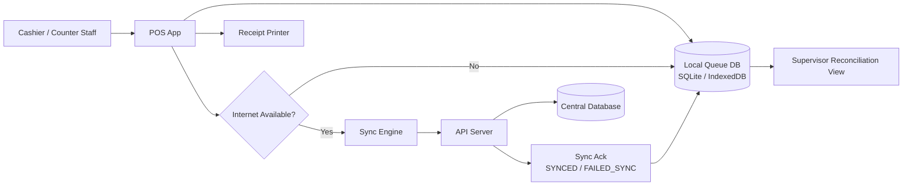
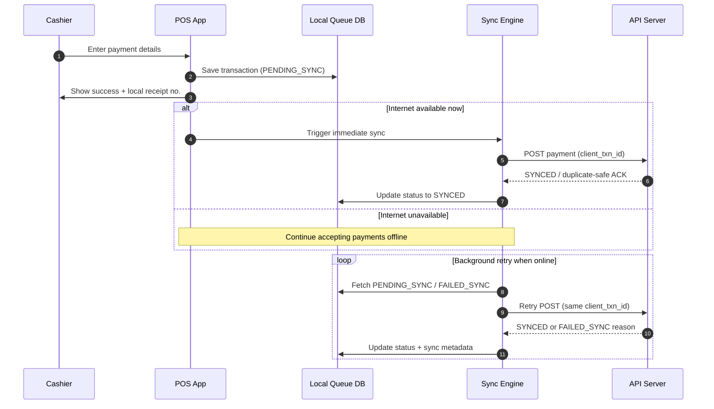
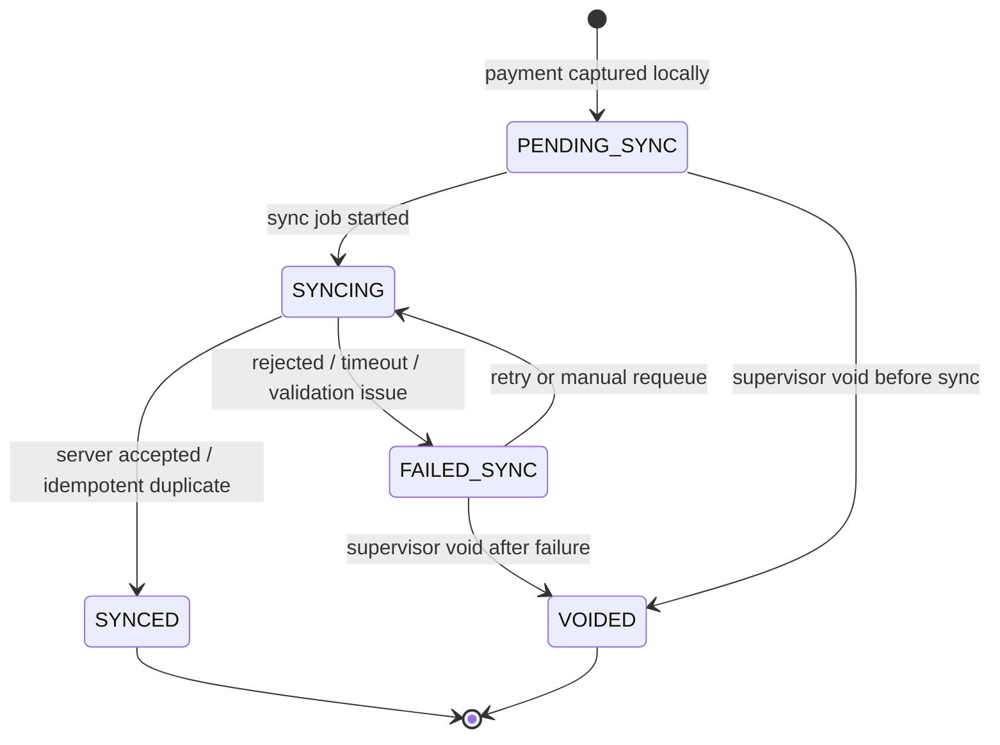

# POS Offline Mode Diagram

## Scope
This design is for **POS module only** so payment collection can continue when internet is unavailable.

## 1. High-Level Architecture

## 2. Payment Flow (Online/Offline)

## 3. Transaction State Machine

## 4. Key Rules
- Every payment has immutable `client_txn_id` (UUID) for idempotent sync.
- Offline-acceptable channels: cash, cheque, manual methods.
- Online-only channels (gateway/real-time auth) must be blocked or marked pending policy.
- Printed offline receipt must include clear marker: `OFFLINE - Pending Sync`.
- No silent drop: failed sync must stay visible in reconciliation queue.

## 5. Minimum Data Fields (Local Queue)
- `client_txn_id`
- `local_receipt_no`
- `status` (`PENDING_SYNC | SYNCING | SYNCED | FAILED_SYNC | VOIDED`)
- `amount`, `payer`, `zakat_type`, `payment_channel`, `counter_id`, `staff_id`
- `created_at_local`, `last_sync_at`, `sync_error`
