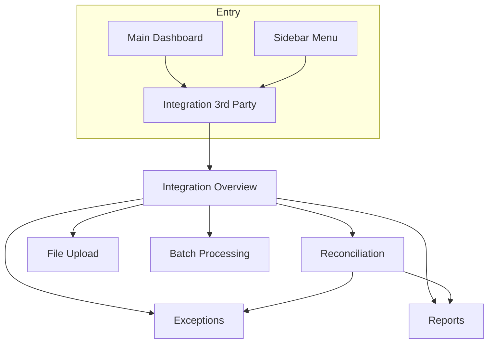
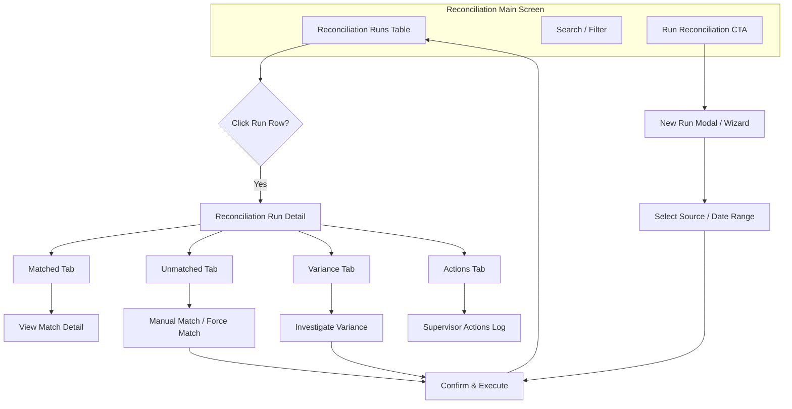
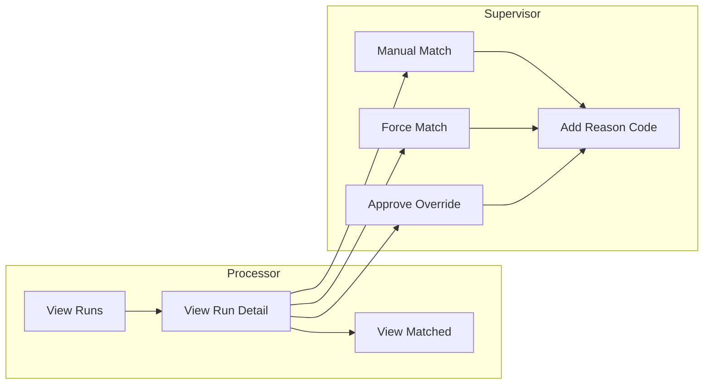
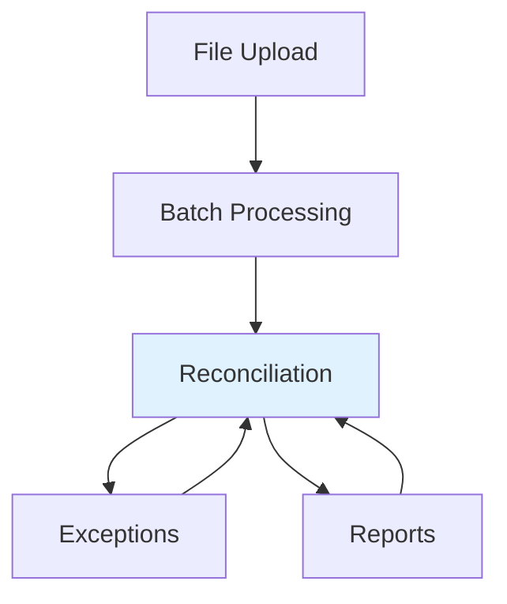

# Reconciliation Process — UI Flow

UI flow for the Integration 3rd Party Reconciliation module in NKS.

**Related:** [Reconciliation Mapping Scenarios](./Reconciliation_Mapping_Scenarios.md) — design for 1:1, 1:N, N:1, N:M mappings.

---

## 1. Entry Points & Navigation



**Entry points:**
- **Sidebar:** Integration 3rd Party → Reconciliation
- **Overview:** Integration Overview → Reconciliation card
- **Direct URL:** `/integration/3rd-party/reconciliation`

**Permission:** `integration.reconcile`

---

## 2. Reconciliation Screen Flow



---

## 3. Screen Hierarchy

| Level | Screen | Route | Description |
|-------|--------|-------|-------------|
| 1 | Integration Overview | `/integration/3rd-party` | Module hub with cards |
| 2 | Reconciliation Main | `/integration/3rd-party/reconciliation` | List of reconciliation runs |
| 3 | Run Detail | `/integration/3rd-party/reconciliation/:runId` | Single run with tabs |
| 4 | Match Detail Modal | — | View staging tx vs internal tx |
| 4 | Manual Match Modal | — | Search & link internal transaction |
| 4 | Force Match Modal | — | Supervisor override with reason |

---

## 4. Reconciliation Main Screen (Current)

**Path:** `/integration/3rd-party/reconciliation`

```
┌─────────────────────────────────────────────────────────────────────────┐
│ Integration 3rd Party - Reconciliation                                  │
│ Perform reconciliation with internal NKS records. Match external        │
│ transactions with internal records.                                      │
├─────────────────────────────────────────────────────────────────────────┤
│ ┌─────────────────────────────────────────────────────────────────────┐ │
│ │ Reconciliation Runs                              [Carian...] [Run]  │ │
│ ├─────────────────────────────────────────────────────────────────────┤ │
│ │ Run ID │ Date       │ Matched │ Unmatched │ Status                  │ │
│ │ ───────┼────────────┼─────────┼───────────┼────────────────────────  │ │
│ │ R001   │ 2025-03-04 │ 142     │ 8         │ Completed               │ │
│ │ R002   │ 2025-03-03 │ 98      │ 2         │ Completed               │ │
│ │ ...    │            │         │           │                         │ │
│ └─────────────────────────────────────────────────────────────────────┘ │
└─────────────────────────────────────────────────────────────────────────┘
```

**Actions:**
- **Search** — Filter runs by Run ID, date, status
- **Run Reconciliation** — Start new reconciliation run (future)
- **Click row** — Open Run Detail (future)

---

## 5. Reconciliation Run Detail (Proposed)

**Path:** `/integration/3rd-party/reconciliation/:runId`

```
┌─────────────────────────────────────────────────────────────────────────┐
│ ← Back to Runs    Reconciliation Run R001 — 2025-03-04                  │
├─────────────────────────────────────────────────────────────────────────┤
│ [Matched] [Unmatched] [Variance] [Actions]                               │
├─────────────────────────────────────────────────────────────────────────┤
│ Summary: Matched 142 | Unmatched 8 | Variance 0                          │
├─────────────────────────────────────────────────────────────────────────┤
│                                                                          │
│  (Tab content: table of results with filters)                           │
│                                                                          │
│  Unmatched: [View] [Manual Match] [Force Match]                          │
│  Variance:  [View] [Investigate] [Approve Override]                      │
│                                                                          │
└─────────────────────────────────────────────────────────────────────────┘
```

**Tabs:**
- **Matched** — Auto-matched transactions (read-only, expand for detail)
- **Unmatched** — No match found; actions: Manual Match, Force Match
- **Variance** — Amount/ref mismatch; actions: Investigate, Approve Override
- **Actions** — Audit log of supervisor actions

---

## 6. User Actions Flow



---

## 6.1 Data Source Mapping (Reconciliation Target)

| Upload Source Category | Source Data (Examples) | Matched Against |
|------------------------|------------------------|-----------------|
| **PSP** (Platform Saluran Pembayaran) | BILPIZ | **GuestPayment** |
| **SPG** (Skim Potongan Gaji) | JAN | **Bank Statement** |
| **BANK** | BANK_ISLAM, MAYBANK | **Bank Statement** |

- **PSP** uploads (e.g. BilPiz) are reconciled against **GuestPayment** (IC, amount, date, receipt reference).
- **JAN** and **BANK** uploads are reconciled against **Bank Statement** (payment reference, approval code, cheque no, date + amount).

---

## 7. Cross-Module Flow



- **File Upload** → **Batch Processing** — Staged transactions feed reconciliation
- **Reconciliation** → **Exceptions** — Unmatched/variance items can go to exception queue
- **Reconciliation** → **Reports** — Reconciliation Report tab in Reports
- **Exceptions** → **Reconciliation** — Resolved exceptions may re-trigger reconciliation

---

## 8. Modal Flows

### 8.1 Manual Match Modal

```
┌─────────────────────────────────────────────────────┐
│ Manual Match — Staging TX #12345                     │
├─────────────────────────────────────────────────────┤
│ External: IC 900101-01-1234 | RM 150.00 | 2025-03-01│
│                                                      │
│ Search internal transaction:                         │
│ [IC / Name / Ref...]                    [Search]     │
│                                                      │
│ Results:                                             │
│ ○ TX-001 | 900101-01-1234 | RM 150.00 | Matched     │
│ ○ TX-002 | 900101-01-1234 | RM 150.00 | Pending     │
│                                                      │
│ [Cancel]                          [Confirm Match]    │
└─────────────────────────────────────────────────────┘
```

### 8.2 Force Match Modal (Supervisor)

```
┌─────────────────────────────────────────────────────┐
│ Force Match — Supervisor Override                    │
├─────────────────────────────────────────────────────┤
│ Staging TX #12345 — No auto-match found              │
│                                                      │
│ Reason code: [Dropdown: Manual entry / Bank error...] │
│ Justification: [Text area - required]                │
│                                                      │
│ [Cancel]                          [Force Match]      │
└─────────────────────────────────────────────────────┘
```

---

## 9. Status & Match Status Mapping

| UI Label   | `ReconciliationMatchStatus` | Description                    |
|-----------|-----------------------------|--------------------------------|
| Matched   | `MATCHED`                   | Auto or manual match           |
| Duplicate | `DUPLICATE`                 | Duplicate transaction          |
| Variance  | `MISMATCH`                  | Amount/ref mismatch            |
| Unmatched | `UNMATCHED`                 | No match found                 |

---

## 10. Responsive & Accessibility

- Tables: horizontal scroll on small screens
- Modals: full-width on mobile, max-width on desktop
- Keyboard: Tab order, Enter to confirm, Esc to close
- Labels: Bahasa Melayu primary, English where needed

---

## 11. Routes Summary

| Route | Component | Purpose |
|-------|-----------|---------|
| `/integration/3rd-party` | IntegrationOverviewView | Module hub |
| `/integration/3rd-party/reconciliation` | IntegrationReconciliationView | Runs list |
| `/integration/3rd-party/reconciliation/:fileId` | IntegrationReconciliationRunDetailView | Run detail |

---

## 12. Implementation Status

| Component | Status |
|-----------|--------|
| Reconciliation Main | ✅ Implemented |
| Run Detail (tabs) | ✅ Implemented |
| Manual Match Modal | ✅ UI shell (search/confirm to be wired) |
| Force Match Modal | ✅ UI shell (reason/justify to be wired) |
| `/integration/3rd-party/exceptions` | IntegrationExceptionsView | Exception queue |
| `/integration/3rd-party/reports` | IntegrationReportsView | Reports (incl. reconciliation) |

---

*Document version: 1.0 | Last updated: 2025-03-04*
